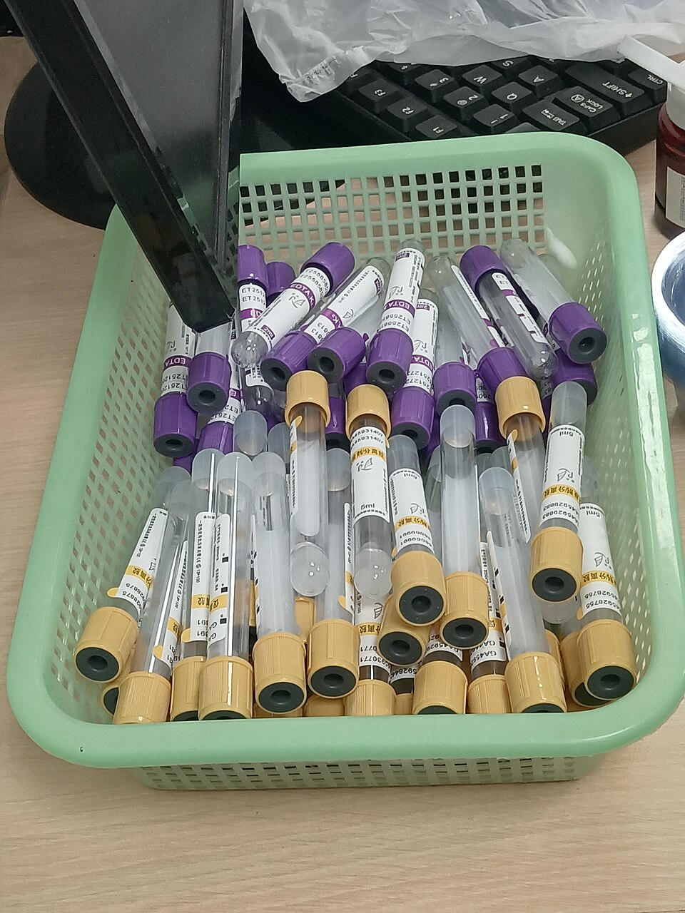
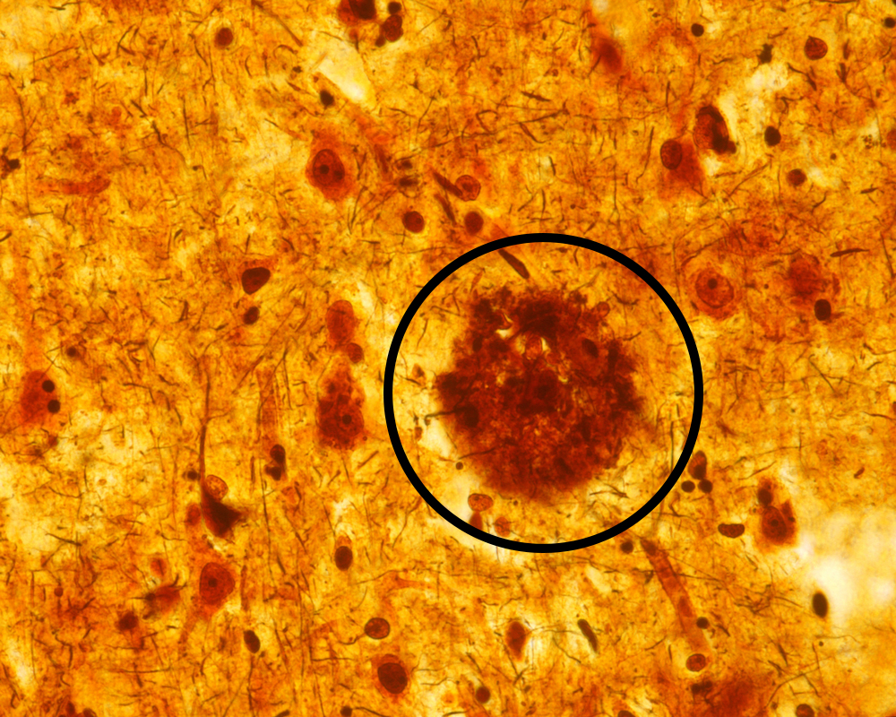
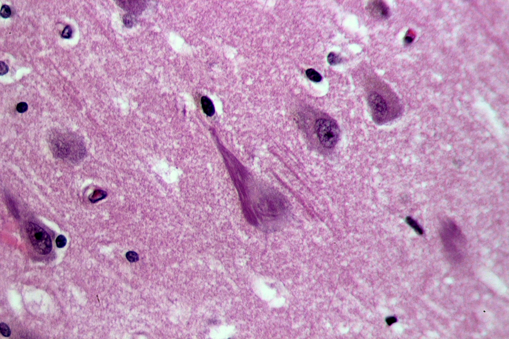
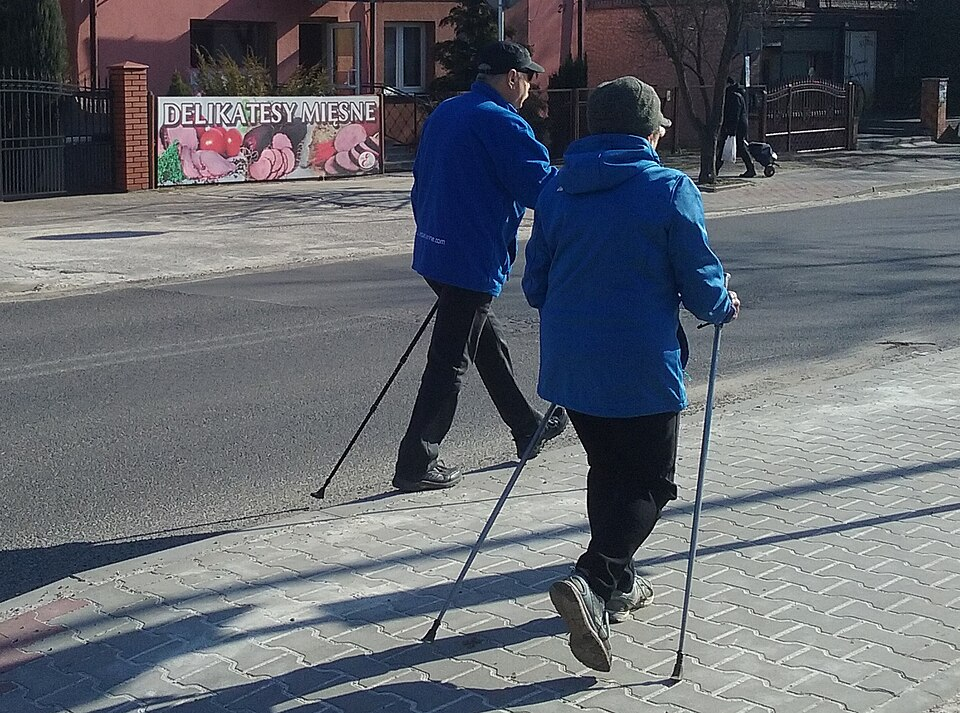
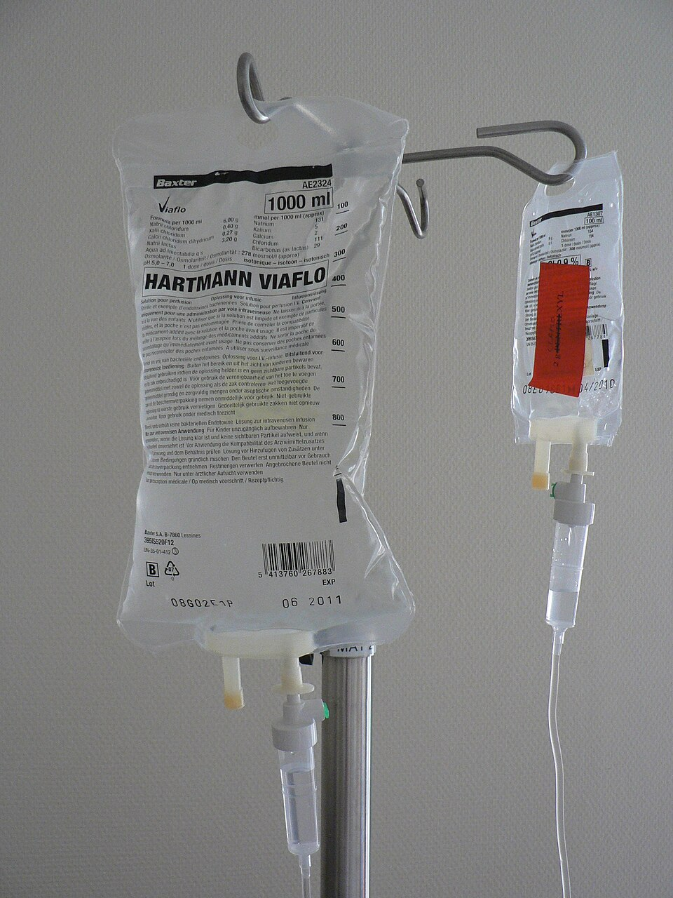

<!-- DRAFT for clinical review. Wording is a starting point only.
     Please verify every clinical and legal statement, especially the
     driving/insurance and medication-availability slides. -->

## What your results mean

:::: {.columns}

::: {.column width="66%"}
::: {.incremental}
- We measured proteins in your [spinal fluid / blood] that change in Alzheimer's disease
- The test looks mainly at two proteins: amyloid and tau
- Your result suggests Alzheimer's changes in the brain
- It is one piece of the picture, alongside your story, examination, pen and paper tests, and scans
- It tells us about the likely cause, not how quickly things will change
:::
:::

::: {.column width="34%"}
{.nostretch fig-alt="Blood collection tubes" width="100%"}
:::

::::

## The disease and dementia are not the same

:::: {.columns}

::: {.column width="50%"}
**The disease** (for example, Alzheimer's)

::: {.incremental}
- The changes slowly building up in the brain
- Can be present for years, often with no symptoms
- This is what your test result reflects
:::
:::

::: {.column width="50%"}
**Dementia**

::: {.incremental}
- A later stage, not a disease in itself
- When those brain changes start to affect everyday life
- It describes the level of difficulty, not the cause
:::
:::

::::

::: {.fragment}
::: {.callout-soft}
Dementia is a later stage - you can have the disease for years before reaching it.
:::
:::

## {background-iframe="assets/biomarker_cascade.html" background-interactive="true"}

::: {.notes}
Interactive biomarker cascade widget. Drag the scrubber or press play to move
through the amyloid, tau, brain-cell-injury and symptom stages.
Move between slides using the on-screen arrows (lower-left).
:::

## {background-iframe="assets/amyloid_aggregation.html" background-interactive="true"}

::: {.notes}
Amyloid aggregation widget (self-contained, works offline).
Zooms in on how amyloid clumps together.
:::

## {background-iframe="assets/plaque_formation.html" background-interactive="true"}

::: {.notes}
Plaque formation widget - now a self-contained, offline-safe build
(React + ReactDOM vendored locally, JSX pre-compiled, no fetches).
:::

## A real plaque, under the microscope

{.nostretch fig-alt="A silver-stained amyloid plaque among brain cells, seen under the microscope" width="58%"}

## {background-iframe="assets/Tau_Pathology.html" background-interactive="true"}

::: {.notes}
Tau pathology widget (self-contained standalone, offline-safe).
:::

## Tau tangles, under the microscope

{.nostretch fig-alt="Neurofibrillary tau tangles in hippocampal neurons, H and E stain" width="62%"}

## Keeping yourself physically well

:::: {.columns}

::: {.column width="66%"}
::: {.incremental}
- What is good for the heart is good for the brain
- Keep blood pressure, cholesterol and blood sugar well controlled
- Stay physically active - aim for regular exercise on most days
- Look after your bones - vitamin D, calcium, and reducing falls
- Don't smoke, and keep alcohol within safe limits
- Stay socially active, protect your sleep, and look after your hearing
:::
:::

::: {.column width="34%"}
{.nostretch fig-alt="Two people Nordic walking outdoors" width="100%"}
:::

::::

## Driving and your insurance

:::: {.columns}

::: {.column width="66%"}
::: {.callout-soft}
If you drive
:::

::: {.incremental}
- A diagnosis can affect driving and must be handled properly
- If you are diagnosed with dementia, you must tell the DVLA
- You must also tell your car insurance company
- Many people with mild difficulties can keep driving, sometimes after an assessment
- Not telling them can make your insurance invalid
:::
:::

::: {.column width="34%"}
{.nostretch fig-alt="A car steering wheel" width="100%"}
:::

::::

## Medications for symptoms

:::: {.columns}

::: {.column width="66%"}
::: {.incremental}
- Some medicines can help with symptoms; they do not change the disease itself
- "Cholinesterase inhibitors" - donepezil, rivastigmine, galantamine
- Memantine - used at later stages, or alongside
- They may help memory a little, concentration and daily activities for a time
- We discuss the benefits and side effects, they're not for early disease
:::
:::

::: {.column width="34%"}
{.nostretch fig-alt="Blister packs of tablets" width="100%"}
:::

::::

## Newer medications (not yet available here)

:::: {.columns}

::: {.column width="66%"}
::: {.incremental}
- Newer treatments aim to clear amyloid from the brain
- You may have seen these in the news - lecanemab, donanemab
- In early disease they can modestly slow decline; they are not a cure
- They carry risks and need regular monitoring scans
- Not yet routinely available [on the NHS] - we will keep you informed
:::
:::

::: {.column width="34%"}
{.nostretch fig-alt="Intravenous infusion bags on a drip stand" width="100%"}
:::

::::

## Taking part in research

:::: {.columns}

::: {.column width="66%"}
::: {.incremental}
- We rely on you to help us better understand the condition and test new treatments
- Studies range from simple questionnaires to new treatment trials
- Taking part is voluntary
- People in research have better outcomes
- We can tell you what is open and what might suit you
:::
:::

::: {.column width="34%"}
{.nostretch fig-alt="Scientists working in a laboratory" width="100%"}
:::

::::

## Planning for the future

:::: {.columns}

::: {.column width="66%"}
::: {.incremental}
- Planning early keeps you in control of decisions that matter to you
- Set up a Lasting Power of Attorney - one for **health and welfare**, one for **finances**
- Make or update your will, and organise finances and any benefits
- **Share your wishes** for future arrangements with the people close to you
- Support is available - Alzheimer's Society, Age UK, Together Dementia Support (GM), and our local community services
:::
:::

::: {.column width="34%"}
{.nostretch fig-alt="A contract document with a pen" width="100%"}
:::

::::
