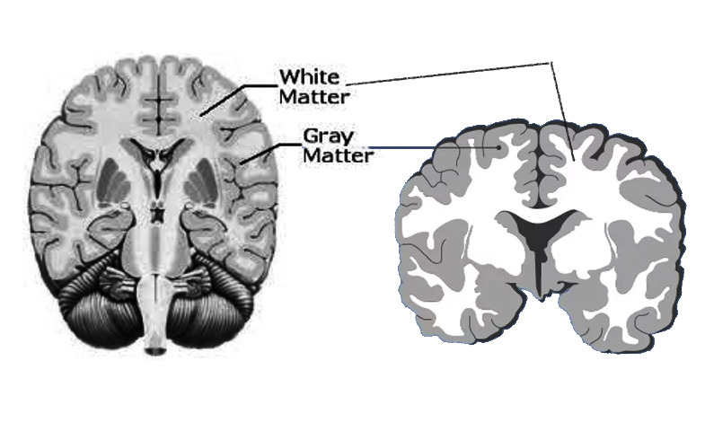
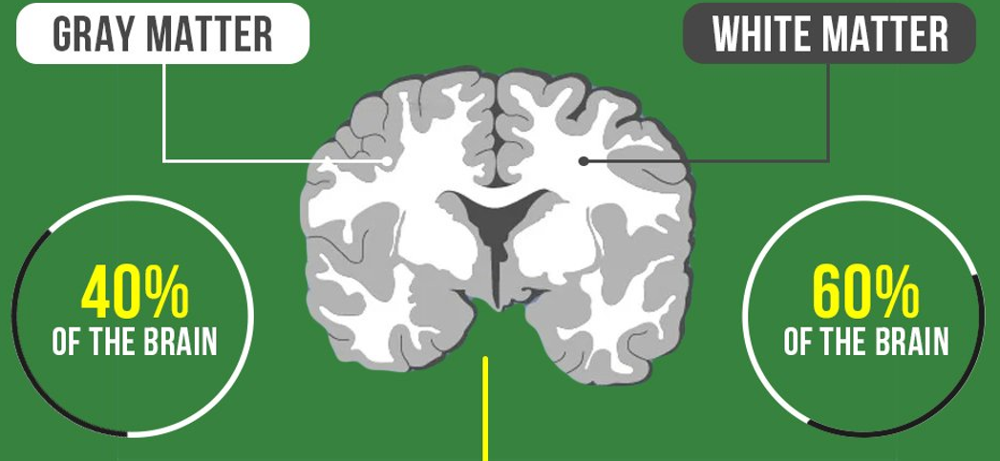
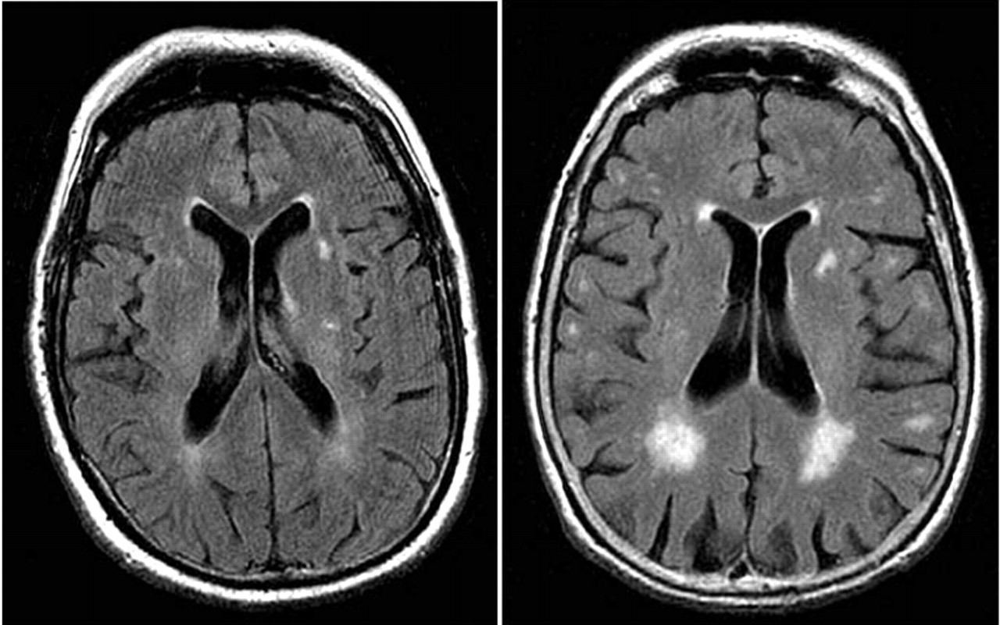
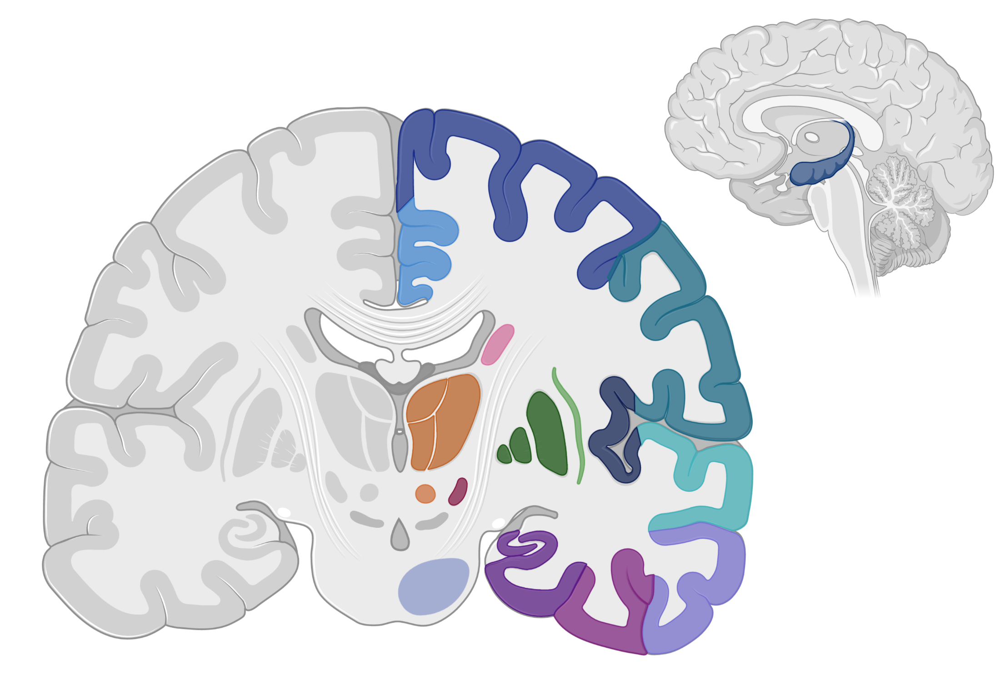
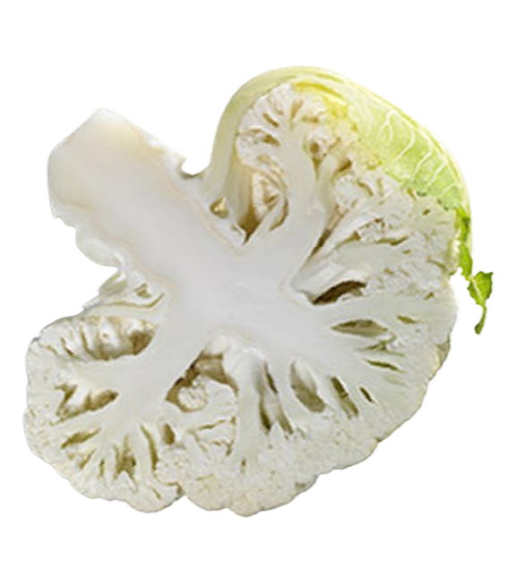
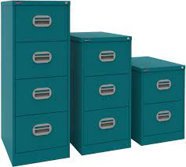
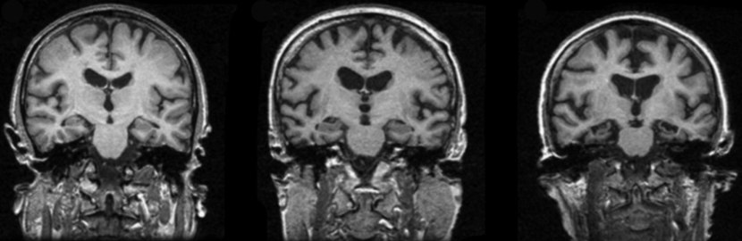
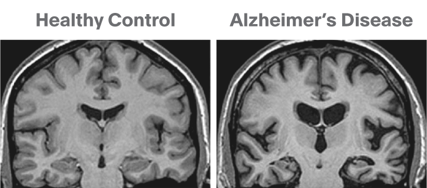
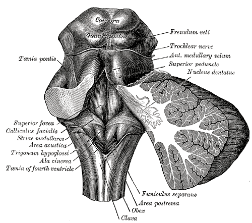
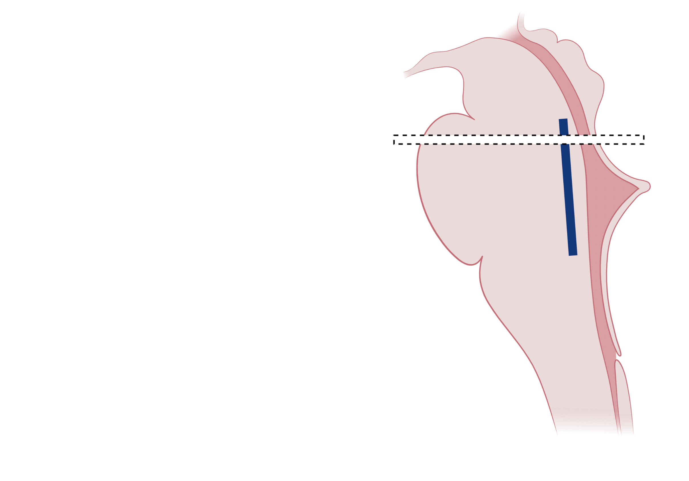

## Grey matter

- Your brain is not all grey matter
- The grey matter is on the outside
- The grey matter is specialised
- A brain scan can show the size of different areas of grey matter

## {.center}

{.nostretch fig-alt="A brain section showing grey matter and white matter" width="90%"}

## {.center}

{.nostretch fig-alt="Grey matter is about 40 percent of the brain and white matter about 60 percent" width="80%"}

## White matter

- Areas of grey matter need to talk to each other, they are wired together
- The "wiring" is made of long brain cells, and they are coated in fatty tissue
- The fatty tissue makes the wiring look white - it is called white matter

## White matter is damaged by slow blood flow

```{=html}
<div class="image-stage">
  
  <!-- Precise lesion masks (traced from the scan). Left scan on first click, right on second. -->
  
  
</div>
```

## Grey matter disease {auto-animate=true}

{.absolute data-id="brain" top="130" left="240" width="800"}

{.absolute .transparent data-id="cauli" top="460" left="825" width="200"}

{.absolute .transparent data-id="roll" top="475" left="115" width="150" fig-alt="A swiss roll in cross-section, resembling the rolled-up hippocampus"}

## Grey matter disease {auto-animate=true}

{.absolute data-id="brain" top="130" left="240" width="800"}

{.absolute .transparent data-id="cauli" top="460" left="660" width="200"}

{.absolute .transparent data-id="roll" top="525" left="415" width="50" fig-alt="A swiss roll in cross-section, resembling the rolled-up hippocampus"}

## Grey matter disease {auto-animate=true}

{.absolute data-id="brain" top="130" left="240" width="800"}

{.absolute .transparent data-id="cauli" top="460" left="825" width="200"}

{.absolute .transparent data-id="roll" top="475" left="115" width="150" fig-alt="A swiss roll in cross-section, resembling the rolled-up hippocampus"}

## What is the job of the hippocampus?

:::: {.columns}

::: {.column width="52%"}
- The brain's filing cabinets
- Store new information
- Recall previously learned information
- Things are stored thematically (like is stored with like)
:::

::: {.column width="48%"}
{.nostretch fig-alt="A row of filing cabinets" width="78%"}
:::

::::

## The progress of Alzheimer disease

{.absolute top="150" left="100" width="1100" fig-alt="Three brain scans showing increasing shrinkage" width="90%"}

## {.center}

{.nostretch fig-alt="A healthy brain next to a brain affected by Alzheimer's disease" width="80%"}

## Hippocampus not the only area affected by AD

- The first areas affected may show signs - under the microscope - 20 years before
- Some areas affecting sleep
- Some areas affecting mood

## Locus Coeruleus

(The blue bit)

:::: {.columns}

::: {.column width="52%"}
{.nostretch fig-alt="An anatomical drawing of the brainstem" width="80%"}
:::

::: {.column width="48%"}
{.nostretch fig-alt="A diagram of the pons with the locus coeruleus marked in blue" width="92%"}

::: {.center-text}
Pons
:::
:::

::::
